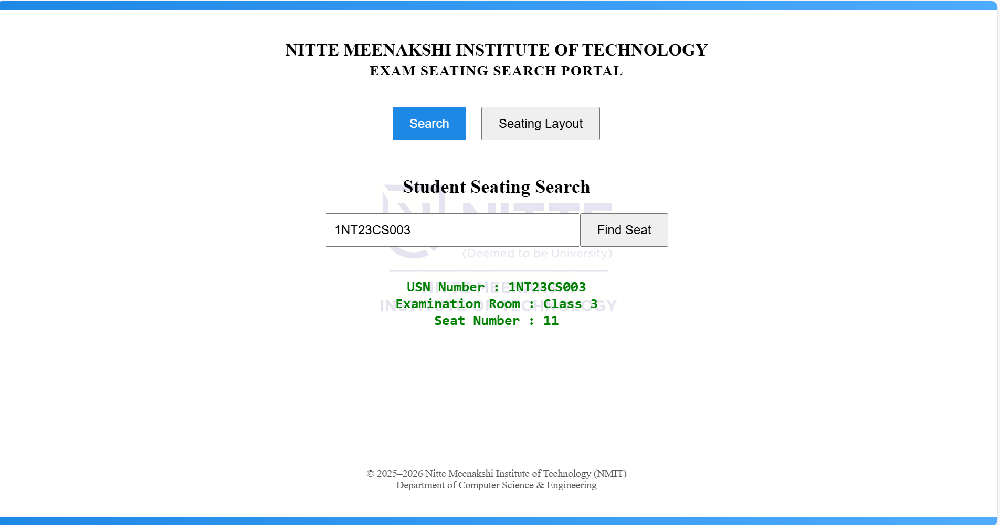
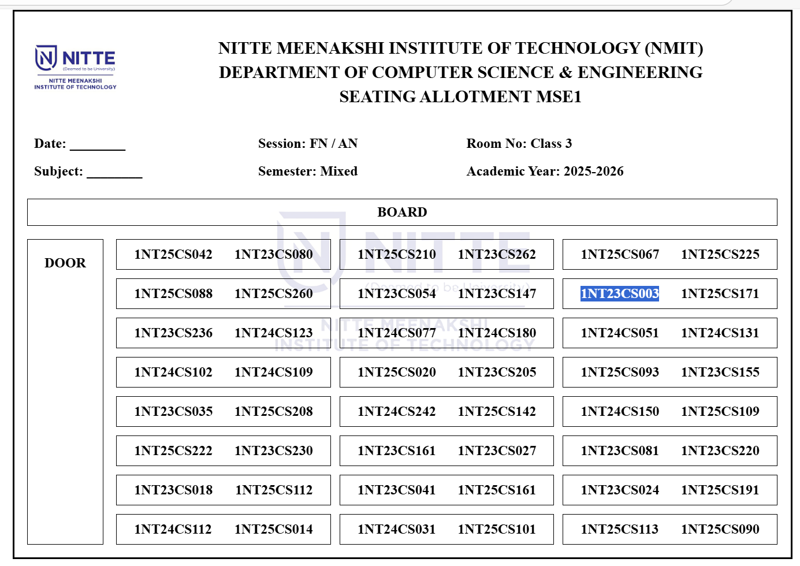
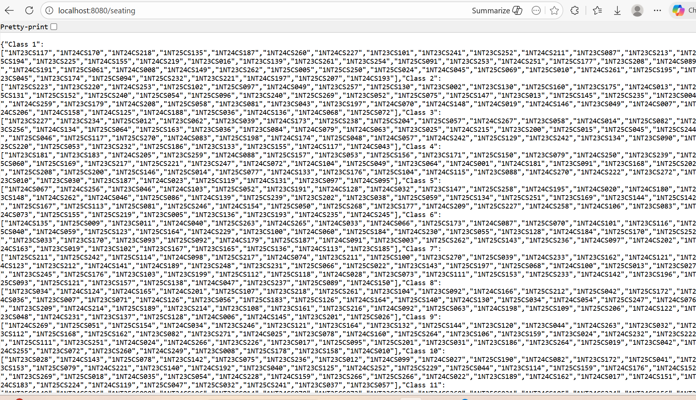

# 

## 📸 Project Screenshots

### 🔎 Student Seat Search

### 🪑 Seating Layout

### 📋 Students List

#
Exam-Seating-System
Full Stack Exam Seating Allocation System built using Spring Boot and React. Implements student seat assignment and search functionality.

⭐ Developed as part of a full stack academic project and later enhanced independently.

# Full Stack Exam Seating Allocation System

A web-based application built using Spring Boot and React that automates student seat allocation during examinations and provides an efficient search functionality.

## 🚀 Features
- Automated exam seat allocation
- Student seating search by USN
- Interactive seating layout
- REST API integration
- Responsive frontend

## 🛠 Tech Stack
Frontend:
- React JS
- CSS
- JavaScript

Backend:
- Spring Boot
- Java
- REST APIs

Tools:
- Git & GitHub
- Maven

## 📌 Project Structure
module2
 ├── backend_m2
 └── frontend_m2

## ▶️ How to Run the Project

### Backend
1. Navigate to backend_m2
2. Run:

mvn spring-boot:run

Server starts at:

http://localhost:8080

### Frontend
1. Navigate to frontend_m2
2. Install dependencies:

npm install

3. Start React app:

npm start

Runs on:

http://localhost:3000

## 🎯 Future Enhancements
- Admin dashboard
- Database integration
- Authentication
- Cloud deployment

## 👩‍💻 Author
Chandana Priya
